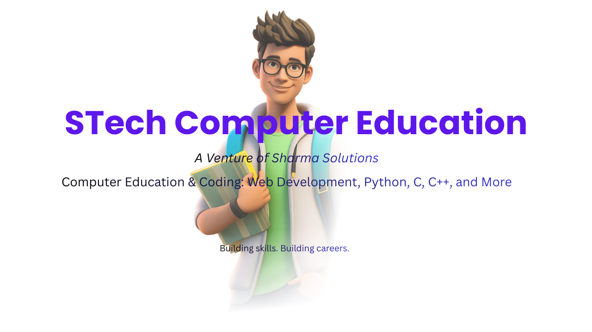

  

## 💻 About Us

 **STech Computer Education** (A Venture of Sharma Solutions) – providing computer education, coding courses, and **hands-on real-world projects** in **Web Development, Python, C, and C++**.

---

## 🚀 Core Programs

- **Full Stack Web Development** 🌐  
- **Python Programming** 🐍  
- **C Programming** 💻  
- **C++ with OOP** ⚡  
- **Data Structures & Logic Building** 📊  
- **App Development with React Native** 📱  

---

## 🏫 Teaching Approach

- **Project-Based Learning**  
- **Clean Code Practices**  
- **Real-World Development Scenarios**  
- **Structured Batch Training**  
- **Continuous Practice Assignments**  

---

## 🛠 Technologies

  

---

## 🎓 Student Project Showcase

Explore demo projects, practice exercises, and example code for learners in **Web Development, Python, C, and C++**.  

We **update** this repository with coding examples, mini-projects, and educational resources for hands-on practice.

---

## 🔗 Connect With Us

  🌐 Website: https://sharmasolutions.in &nbsp; | &nbsp;
  📩 Email: info@sharmasolutions.in

---

  <i style="color:#9ca3af;">“Code. Learn. Build. Grow.”</i>

